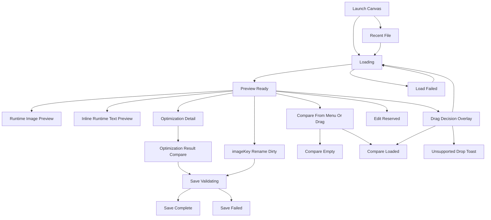

# Short-term UI/UX Low-fidelity Information Architecture

Date: 2026-07-04
Status: draft low-fidelity IA and wireframes, updated for Owner-confirmed canvas direction
Authority: subordinate to `docs/product/PRODUCT_ROADMAP.md`

## Purpose

This document turns the short-term PRD, UI/UX brief, manifest, and design
system spec into low-fidelity information architecture and state wireframes.

It is not a PRD, visual design, or implementation plan. It does not define new
product scope. Its job is to make the short-term app structure reviewable
before high-fidelity Figma work or production UI code.

## Product Boundaries

Covered short-term scope:

- S1 open local SVGA
- S2 playback and abnormal states
- S3 file information
- S4 production-spec status and optimization-context detail
- S5 all asset information
- S6 thumbnails
- S7 replaceable-element identification
- S8 optimization opportunities
- S9 real optimization output
- S10 optimization comparison flow
- S11 imageKey key rename
- S12 runtime replaceable image preview
- S13 runtime replaceable text preview
- S14 context-specific Save As / Overwrite Save
- S15 no-audio and unsupported-audio truthfulness
- S16 recent SVGA files on launch and File menu

Out of scope:

- export acceptance
- sequence-frame repair
- advanced layer editing
- full timeline or motion authoring
- batch replacement
- AI/cloud/accounts/telemetry

## App Shell

The short-term shell is canvas-first. It does not use a persistent toolbar with
Open, Compare, and mode controls.

```text
┌──────────────────────────────────────────────────────────────────────────┐
│ ● ● ●                                                                    │
│                                                                          │
│                         immersive canvas surface                         │
│                                                                          │
│                  mode switch or state UI appears on canvas               │
│                                                                          │
│                                                          right info area │
└──────────────────────────────────────────────────────────────────────────┘
```

Shell zones:

| Zone | Content | PRD IDs |
| --- | --- | --- |
| Native chrome | macOS traffic lights | app shell |
| Canvas | launch drop surface, preview artwork, drag overlay, compare previews, optimization before/after previews | S1, S2, S10 |
| Canvas top center | Preview / Edit switch when a file surface is active | app mode |
| Canvas bottom | playback controls; disabled in compare empty state | S2 |
| Right information area | default file/asset/replaceable info, optimization detail/result, or compare panel | S3-S14 |
| macOS menu | Open, Recent, Compare, Settings, appearance, logs, window/help actions | S1, S14, S16 |

## Menu Bar IA

```text
Auto SVGA
File
Edit
View
Playback
Resource
Optimize
Window
Help
```

Menu requirements:

- `File > Open SVGA` opens or replaces the current file.
- `File > Recent` shows up to ten recent SVGA records and clear history.
- `View > Compare` enters compare. If no file is open, it starts a two-file
  selection flow.
- Settings and appearance live in the macOS menu, not on the main canvas.

Forbidden menu items:

- Export Acceptance
- Sequence Repair
- Batch Replacement
- Advanced Layer Editing
- AI Generation

## State Flow



## Low-fidelity States

### Launch Canvas

```text
┌─────────────────────────────────────────────┐
│ ● ● ●                                       │
│                                             │
│                 [upload icon]              │
│              拖拽文件到此处                 │
│                [打开文件]                  │
│                                             │
│        最近打开                         [trash] │
│        avatar_frame.svga        4 分钟前      │
│        profile_border.svga      4 分钟前      │
└─────────────────────────────────────────────┘
```

Trace: S1, S2, S16.

Note: The low-fidelity frame does not render motion, but the Launch canvas may
use a subtle checkerboard idle background drift. It remains background-only and
is static when reduced motion is requested.

### Preview Ready

```text
┌──────────────────────────────┐ ┌──────────────────────┐
│ ● ● ●        Preview | Edit   │ │ filename.svga        │
│                              │ │ File facts           │
│         SVGA artwork         │ │ compact spec status  │
│                              │ │ imageKey rows        │
│ playback controls            │ │ asset rows           │
└──────────────────────────────┘ └──────────────────────┘
```

Trace: S2, S3, S4, S5, S6, S7, S12, S13, S15.

### Preview Dirty From imageKey Rename

```text
┌──────────────────────────────┐ ┌──────────────────────┐
│          Preview | Edit       │ │ filename.svga * [另存为] │
│         SVGA artwork         │ │ imageKey row editing │
└──────────────────────────────┘ └──────────────────────┘
```

Trace: S11, S14.

Rules:

- Only key rename creates dirty bytes in Preview.
- Runtime image/text replacement does not dirty the SVGA file.
- Save As success removes `*` and leaves Save As visible but disabled.

### Inline Runtime Text Preview

```text
┌──────────────────────────────┐ ┌──────────────────────┐
│         SVGA artwork         │ │ imageKey             │
│                              │ │ text_key [edit key]  │
│                              │ │ [输入文字以预览____] │
└──────────────────────────────┘ └──────────────────────┘
```

Trace: S13.

### Drag Decision Overlay

```text
┌────────────────────────────────────────────────────┐
│ semi-transparent black overlay                     │
│                                                    │
│   Add As Compare File secondary zone               │
│   top strip, default 25% height                    │
│   allowed range: 20%-30% height                    │
│   supported file: focused zone = green             │
├────────────────────────────────────────────────────┤
│                                                    │
│   Open File primary zone                           │
│   lower zone, default 75% height                   │
│   allowed range: 70%-80% height                    │
│   unsupported file: focused zone = red             │
└────────────────────────────────────────────────────┘
```

The overlay is top/bottom, not left/right. Add As Compare File owns the top
secondary strip. Open File owns the lower primary target, the canvas center,
the lower-center, and the bottom-entry casual drop path so bottom-to-center
drag habits do not accidentally trigger compare. Compare is opt-in and requires
deliberately moving into the top strip.

Trace: S1, S2, S10.

Unsupported drop:

```text
canvas clears
toast: 不支持的文件格式
```

### Optimization Detail / Result

```text
┌────────────────────────┐ ┌────────────────────────┐ ┌───────────────┐
│ Before preview          │ │ After preview           │ │ 优化结果对比   │
│                         │ │                         │ │ before facts  │
│                         │ │                         │ │ after facts   │
│                         │ │                         │ │ [另存为 SVGA] │
│                         │ │                         │ │ [覆盖保存]    │
│                         │ │                         │ │ 放弃优化      │
└────────────────────────┘ └────────────────────────┘ └───────────────┘
```

Trace: S8, S9, S10, S14.

### Compare Empty

```text
┌────────────────────────┐ ┌────────────────────────┐ ┌───────────────┐
│ Empty compare slot A    │ │ Empty compare slot B    │ │ 对比模式       │
│ [打开文件]              │ │ [打开文件]              │ │ 未打开文件     │
│ disabled playback controls remain visible          │ │ 未打开文件     │
└────────────────────────┘ └────────────────────────┘ └───────────────┘
```

Trace: S10.

### Compare Loaded

```text
┌────────────────────────┐ ┌────────────────────────┐ ┌───────────────┐
│ Preview A               │ │ Preview B               │ │ 对比模式       │
│                         │ │                         │ │ A/B facts     │
│                         │ │                         │ │ differences   │
│ playback controls       │ │ playback controls       │ │ [退出对比]    │
└────────────────────────┘ └────────────────────────┘ └───────────────┘
```

Trace: S10.

### Edit Reserved

```text
┌──────────────┐ ┌─────────────────────────────────┐ ┌────────────────┐
│ Layer list   │ │ Preview canvas                  │ │ Reserved       │
│ thumbnail    │ │ playback controls               │ │ no inactive    │
│ layer name   │ │                                 │ │ controls       │
└──────────────┘ └─────────────────────────────────┘ └────────────────┘
```

Short-term Edit mode may show the left layer list only. The right operation
area remains a quiet placeholder and must not expose inactive advanced editing
controls.

## S1-S16 Surface Trace

| PRD ID | Primary state | Module |
| --- | --- | --- |
| S1 | Launch, Loading, Drag Decision | `LaunchModule`, `DragDecisionOverlay` |
| S2 | Loading, Load failed, Preview, Unsupported Drop | `PreviewCanvasModule` |
| S3 | Preview Ready | `RightInformationSurface` |
| S4 | Preview Ready, Optimization Detail | `RightInformationSurface`, `OptimizationDetailSurface` |
| S5 | Preview Ready | `RightInformationSurface` |
| S6 | Preview Ready | `RightInformationSurface` |
| S7 | Preview Ready | `ReplaceableElementsSurface` |
| S8 | Preview Ready, Optimization Detail | `OptimizationEntrySurface` |
| S9 | Optimization Result | `OptimizationCompareModule` |
| S10 | Compare states, Optimization Result | `GeneralCompareModule`, `OptimizationCompareModule` |
| S11 | Rename Dirty | `ReplaceableElementsSurface` |
| S12 | Runtime image replacement | `ReplaceableElementsSurface` |
| S13 | Inline runtime text preview | `ReplaceableElementsSurface` |
| S14 | Save states | `SaveStateModule` |
| S15 | Preview Ready | `RightInformationSurface` |
| S16 | Launch, File menu, recent missing state | `LaunchModule`, `MenuBarCommandModel` |

## Reference Sketches

Owner-provided local sketches were reviewed as reference input and should not
be committed unless the Product Owner explicitly asks. Stable local archive:
`/Users/huangtengxin/Documents/Auto_SVGA_References/2026-07-04-owner-canvas-direction/`.

Do not rely on the original Desktop copies; they may be removed during routine
cleanup. The archive includes a local README with file hashes.

- `/Users/huangtengxin/Documents/Auto_SVGA_References/2026-07-04-owner-canvas-direction/启动页.png`
- `/Users/huangtengxin/Documents/Auto_SVGA_References/2026-07-04-owner-canvas-direction/预览页.png`
- `/Users/huangtengxin/Documents/Auto_SVGA_References/2026-07-04-owner-canvas-direction/预览模式.png`
- `/Users/huangtengxin/Documents/Auto_SVGA_References/2026-07-04-owner-canvas-direction/拖拽对比.png`
- `/Users/huangtengxin/Documents/Auto_SVGA_References/2026-07-04-owner-canvas-direction/拖拽对比_不支持格式.png`
- `/Users/huangtengxin/Documents/Auto_SVGA_References/2026-07-04-owner-canvas-direction/编辑模式.png`
- `/Users/huangtengxin/Documents/Auto_SVGA_References/2026-07-04-owner-canvas-direction/预览模式_对比模式.png`
- `/Users/huangtengxin/Documents/Auto_SVGA_References/2026-07-04-owner-canvas-direction/预览模式_对比模式_空.png`
- `/Users/huangtengxin/Documents/Auto_SVGA_References/2026-07-04-owner-canvas-direction/预览模式_对比模式_拖拽.png`
- `/Users/huangtengxin/Documents/Auto_SVGA_References/2026-07-04-owner-canvas-direction/预览模式_优化对比.png`

## Open Decisions Preserved

- final default and minimum supported window size
- exact input styling for inline runtime text replacement
- exact Settings sheet visual layout
- first-build optimization methods
