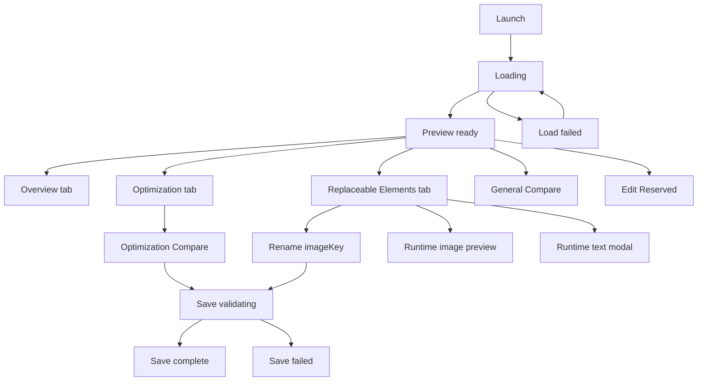

# Short-term UI/UX Low-fidelity Information Architecture

Date: 2026-07-01
Status: draft low-fidelity IA and wireframes
Authority: subordinate to `docs/product/PRODUCT_ROADMAP.md`

## Purpose

This document turns the short-term PRD, UI/UX brief, manifest, and design
system spec into low-fidelity information architecture and state wireframes.

It is not a PRD, visual design, or implementation plan. It does not define new
product scope. Its job is to make the short-term app structure reviewable
before high-fidelity Figma work or production UI code.

## Product Boundaries

Covered short-term scope:

- S1 open local SVGA
- S2 playback and abnormal states
- S3 file information
- S4 production-spec comparison inside Overview
- S5 all asset information
- S6 thumbnails
- S7 replaceable-element identification
- S8 optimization opportunities
- S9 real optimization output
- S10 optimization comparison flow
- S11 imageKey rename
- S12 runtime replaceable image preview
- S13 runtime replaceable text preview
- S14 Overwrite Save and Save As
- S15 no-audio and unsupported-audio truthfulness
- S16 recent SVGA files on launch and File menu

Out of scope:

- export acceptance
- sequence-frame repair
- advanced layer editing
- full timeline or motion authoring
- batch replacement
- AI/cloud/accounts/telemetry

## App Shell

```text
┌──────────────────────────────────────────────────────────────────────────┐
│ ● ● ●  [Open SVGA] [Compare] [Preview | Edit]      [Overwrite] [Save As] │
├──────────────────────────────────────────────────────────────────────────┤
│                                                                          │
│                         mode-specific content                            │
│                                                                          │
└──────────────────────────────────────────────────────────────────────────┘
```

Toolbar zones:

| Zone | Content | PRD IDs |
| --- | --- | --- |
| Window controls | macOS traffic lights | app shell |
| File controls | Open SVGA, Compare | S1, S10 |
| Mode control | Preview / Edit | app mode |
| Center identity | file identity or concise state | S2-S5 |
| Save controls | Overwrite Save, Save As | S14 |

## Menu Bar IA

```text
Auto SVGA
File
Edit
View
Playback
Resource
Optimize
Window
Help
```

Forbidden menu items:

- Export Acceptance
- Sequence Repair
- Batch Replacement
- Advanced Layer Editing
- AI Generation

## State Flow



## Low-fidelity States

### Launch

```text
┌─────────────────────────────────────────────┐
│ Open local SVGA                             │
│ Drop a file here or use Open SVGA...        │
│ [Open SVGA...]                              │
│ Recent                                      │
│   avatar_frame_intro.svga        parent dir │
│   profile_border_loop.svga       parent dir │
│ Local only                                  │
└─────────────────────────────────────────────┘
```

Trace: S1, S2, S16.

### Loading

```text
┌──────────────────────────────┐ ┌──────────────────────┐
│ Preview loading              │ │ Loading file...       │
│ spinner                      │ │ Parsing SVGA          │
└──────────────────────────────┘ └──────────────────────┘
```

Trace: S1, S2.

### Load Failed

```text
┌──────────────────────────────┐ ┌──────────────────────┐
│ Cannot open this SVGA        │ │ What happened         │
│ Source file was not modified │ │ Parse/load failed     │
│ [Open another SVGA...]       │ │ Recovery              │
└──────────────────────────────┘ └──────────────────────┘
```

Trace: S2.

### Preview Overview

```text
┌──────────────────────────────┐ ┌──────────────────────┐
│ SVGA canvas                  │ │ Overview | Opt | Repl │
│ playback controls            │ │ File facts            │
│                              │ │ Production spec       │
│                              │ │ Assets summary        │
│                              │ │ Audio empty state     │
└──────────────────────────────┘ └──────────────────────┘
```

Trace: S2, S3, S4, S5, S6, S15.

### Preview Optimization

```text
┌──────────────────────────────┐ ┌──────────────────────┐
│ SVGA canvas                  │ │ Optimization          │
│ playback controls            │ │ Finding row           │
│                              │ │ reason + impact       │
│                              │ │ [Run] / review-only   │
└──────────────────────────────┘ └──────────────────────┘
```

Trace: S8, S9.

### Preview Replaceable Elements

```text
┌──────────────────────────────┐ ┌──────────────────────┐
│ SVGA canvas                  │ │ Replaceable images    │
│ playback controls            │ │ imageKey [Replace]    │
│                              │ │ Replaceable text      │
│                              │ │ textKey [Edit]        │
└──────────────────────────────┘ └──────────────────────┘
```

Trace: S7, S12, S13.

### Rename imageKey

```text
Context menu:
┌──────────────────────────────┐
│ Rename imageKey      Cmd+R   │
│ Replace Preview Image        │
│ Reset Preview Replacement    │
└──────────────────────────────┘

Inline row:
┌──────────────────────────────────────────┐
│ thumbnail  [ imageKey_name________ ]     │
│ Enter to confirm · Esc to cancel         │
└──────────────────────────────────────────┘
```

Trace: S11, S14.

### General Compare

```text
┌──────────────┐ ┌─────────────────┐ ┌─────────────────┐ ┌────────────┐
│ A info/assets│ │ Preview A       │ │ Preview B       │ │ B info     │
└──────────────┘ └─────────────────┘ └─────────────────┘ └────────────┘
```

Trace: S10 support context.

### Optimization Compare

```text
┌────────────────────────┐ ┌────────────────────────┐ ┌───────────────┐
│ Before                 │ │ After                  │ │ Optimization  │
│ original preview       │ │ optimized preview      │ │ result        │
└────────────────────────┘ └────────────────────────┘ └───────────────┘
```

Trace: S9, S10, S14.

### Save States

```text
Save validating -> Save complete
Save validating -> Save failed -> Retry / Save As / Return to preview
```

Trace: S14.

### Edit Reserved

```text
┌──────────────┐ ┌─────────────────────────────────┐ ┌────────────────┐
│ Layer list   │ │ Preview canvas                  │ │ Reserved       │
│ thumbnail    │ │ playback controls               │ │ operation area │
└──────────────┘ └─────────────────────────────────┘ └────────────────┘
```

Short-term Edit mode must not expose inactive advanced editing controls.

## S1-S16 Surface Trace

| PRD ID | Primary state | Module |
| --- | --- | --- |
| S1 | Launch, Loading | `LaunchModule` |
| S2 | Loading, Load failed, Preview | `PreviewCanvasModule` |
| S3 | Preview Overview | `OverviewTabModule` |
| S4 | Preview Overview | `OverviewTabModule` |
| S5 | Preview Overview | `OverviewTabModule` |
| S6 | Preview Overview | `OverviewTabModule` |
| S7 | Replaceable Elements | `ReplaceableElementsTabModule` |
| S8 | Preview Optimization | `OptimizationTabModule` |
| S9 | Optimization Compare | `OptimizationCompareModule` |
| S10 | Compare states | `GeneralCompareModule`, `OptimizationCompareModule` |
| S11 | Rename imageKey | `ReplaceableElementsTabModule` |
| S12 | Runtime image replacement | `ReplaceableElementsTabModule` |
| S13 | Runtime text replacement | `ReplaceableElementsTabModule` |
| S14 | Save states | `SaveStateModule` |
| S15 | Preview Overview | `OverviewTabModule` |
| S16 | Launch, File menu, recent missing state | `LaunchModule`, `MenuBarCommandModel` |

## Open Decisions Preserved

- final label for Replaceable Elements
- final default and minimum window size
- text replacement sheet versus modal versus popover
- Compare entry visual style
- exact appearance menu behavior
- first-build optimization methods
